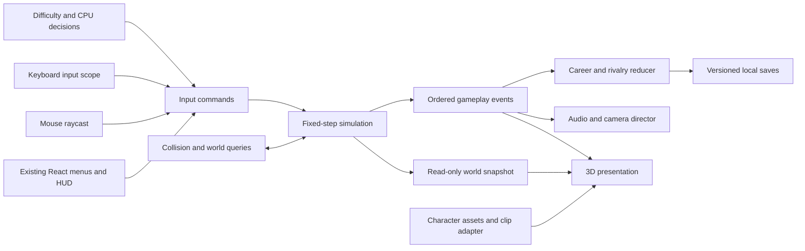

# Proposed architecture — not yet implemented

## Decisions

Retain React/TypeScript/Vinext and existing setup/progression UI. Prefer a client-only React Three Fiber scene backed by Three.js, with selective Drei helpers after compatibility verification. No library versions are installed or promised in Phase 0. Three.js provides the animation/camera/mesh primitives needed for this direction ([official docs](https://threejs.org/docs/)). Evaluate a Rapier kinematic character controller in Phase 2 for collision; keep its integration behind world queries ([official controller documentation](https://rapier.rs/docs/user_guides/javascript/character_controller/)). Physics does not decide wrestling timing or winners.

True 3D acceptance requires perspective camera, solid meshes with depth and shadows, skeletal animation and world-space movement/collision. Temporary characters must be visibly labeled rigged placeholders. Flat image cutouts, billboards and CSS transforms cannot satisfy the gate. Final character art remains a later asset replacement task.

## Migration boundary and data ownership

Future `GameSession` is the sole simulation owner. Commands contain player/entity ID, simulation tick and semantic action, not DOM keys. CPU sends the same commands from observed state after reaction delay. Simulation never imports React, Three, browser speech or GLB loaders. HUD snapshots are emitted at a lower rate; render interpolation can run every frame. Events carry session/event IDs so sound, rewards and camera cues fire exactly once.

World coordinates: meters, Y-up, X/Z ground plane, ring center origin; character root at feet, uniform scale, forward convention documented in asset manifest. Do not reinterpret pixel y as height. Simulation owns position/yaw/velocity and capsule dimensions. Camera-relative movement is converted to world intent; mouse raycasts query floor/interactables. Character presentation cannot change damage or collision bounds based on visual mesh size.

Adopt fixed 60Hz simulation with bounded catch-up and render interpolation; pause freezes simulation clocks. Seeded RNG makes decisions replayable. Use kinematic capsules and static world colliders before dynamic props; paired wrestling actions temporarily coordinate collision groups, validate clearance and restore both actors safely on cancellation. No early ragdoll dependency.

Legacy `engine.ts` and Canvas renderer remain isolated and callable for regression/fallback. Initially add a separate sandbox entry point; do not run legacy and 3D simulation concurrently. Introduce a renderer boundary consuming snapshots/events and a legacy coordinate adapter only for historical comparison. A feature flag may select an explicitly labeled legacy fallback during migration. Production switches to 3D only after the combat/arena gates; no silent fallback marketed as 3D.

## Proposed module contracts

| Module | Owns | Must not own |
|---|---|---|
| `game/core` | Fixed clock, entity IDs, session, snapshots/events | UI or asset loading |
| `game/input` | Input scopes, remapping, semantic commands, raycast targeting | Damage/win decisions |
| `game/combat` | Move registry, transitions, action locks, match rules, submissions/pins | AnimationMixer callbacks as authority |
| `game/ai` | Casual/Normal/Competitive, delayed observations, tactics and errors | Player input reading |
| `game/characters`, `animation` | Manifest, rig/clip mapping, expressions, synchronized presentation | Stats inferred from model geometry |
| `game/arena`, `backstage` | World layout, collider/interaction definitions, portals | Career state |
| `game/camera`, `entrances`, `audio` | Presentation timelines and prioritized cues | Match clock/winner mutation |
| `game/interview`, `postmatch` | Dialogue performance and scene orchestration | Generated replacement of typed text |
| `game/career`, `rivalry`, `saves` | Reducers, managers, versioned persistence | Rendering dependencies |

Proposed session API: `dispatch(command)`, `advance(fixedDt)`, `snapshot()`, `drainEvents()`, `pause()`, `dispose()`. Renderer API: `mount(surface)`, `loadAssets(manifests)`, `present(snapshot, events, alpha)`, `resize(size)`, `dispose()`. Interfaces will be introduced as each phase needs them, not as empty runtime scaffolding in Phase 0.

## Character asset adapter

Use stable string IDs (`rhea`, `chyna`, `charlotte`, `bianca`), with a one-time mapping from old roster indices. A manifest declares asset version, model URL, skeleton profile/bone map, height/scale/forward correction, clip map, expression map, sockets, supported capabilities and LODs. Identity data separately supplies stats, locomotion tuning, move IDs, entrance/victory/taunt timeline and camera profile.

Required rig semantics: root, hips, spine/chest, neck/head, upper/lower arms, hands, upper/lower legs, feet. Hand sockets support weapon/microphone; waist socket supports belt. Each character instance owns its skeleton/mixer; geometry/materials can be cached where safe. Canonical animation names cover idle, walk/run/turn/combat locomotion, reactions, knockdown/recovery, strikes, paired attacker/receiver actions, taunt/entrance/victory/interview. Asset validation reports missing clips/bones. Unsupported optional expressions fall back to head/body poses, not a false facial-animation claim.

Map neutral/focused/confident/smirk/mocking/angry/intimidating/surprised/exhausted/hurt/celebrating to morph targets where available. Speech may drive jaw/visemes if supported; otherwise use modest jaw movement and label approximate lip sync. Model swap acceptance: replace manifest URLs/rig mapping without edits to combat, AI, camera, career or UI, then replay the same fixture with unchanged gameplay outcomes.

## Moves and state machine

Move data includes ID/name/category, attacker/receiver clip IDs, range/facing/height tolerance, stamina/momentum/damage, allowed attacker/receiver states, startup/active/impact/recovery times, counter window, knockdown, target body region, camera/audio cues and mode restrictions. Validate registry on load; reject missing references and impossible timings. Aim for 10–15 meaningful moves per character after core actions work, not 15 labels sharing one clip.

Explicit paths include locomotion/targeting → strikeStartup → strikeActive → strikeRecovery; grappleAttempt → grappleConnected → moveExecution; submission/pin; stunned → grounded → recovering; blocking/reversing; taunting/celebrating. Interrupt rules and resource reservation are explicit. A move cannot coexist with incompatible movement, attack or presentation locks.

Paired moves use one `MoveInstance` with two actor IDs, alignment transforms, a shared simulation clock, impact markers and cleanup rules. Both skeletal clip tracks follow that clock. Contact anchors and authored root trajectories keep hands/hips aligned; bounded IK may correct small differences. Major grapples require articulated attacker and receiver sequences, not model rotation alone. Damage is emitted once when simulation crosses an impact marker, even across multiple catch-up ticks.

Submission state tracks body-region damage, health/stamina ratios, technique/defense, escape progress and rope proximity. Difficulty changes CPU reaction/escape behavior, not omniscient counters. Rope breaks apply only in applicable rules. Show pressure/escape feedback and legal release transitions; pin has separate kick-out rules and three-count timing.

## Presentation, world and story contracts

Four camera modes: broadcast, restrained dynamic combat, presentation close-up and backstage third person. Director blends stable anchors with bounded speed and obstacle avoidance; critical gameplay remains readable. High-priority finisher/entrance cues override low-priority taunts, and ordinary strikes do not constantly cut cameras.

One arena layout holds stage/tunnel/ramp, ringside, ring ropes/turnbuckles, barricades, crowd instances, lighting rig, screen and camera anchors. Cell adds enclosing colliders/mesh to this arena; No-DQ adds contextual props. Backstage is one connected corridor graph with four physically separate themed locker rooms, interview area, Alex/Maria office interactions, loading bay and arena access. Doors use world prompts and collision openings; transitions preserve actor/session state.

Entrance timelines contain lighting, unique stage action, camera, ramp path, crowd cue, ring entry, corner pose and hero shot; skip applies a canonical final state and cancels pending cues. Later championship variants add belt/socket and timeline events. Distinct planned personalities: Rhea deliberate intimidation, Chyna strength poses/press emphasis, Charlotte measured technical posture/submissions, Bianca faster explosive locomotion and athletic poses. Assets must demonstrate these distinctions at their phase gates.

Interview performance takes exact user text plus tone. A deterministic analyzer segments sentences without changing text, derives punctuation/length/keyword cues, and schedules subtitles, generic synthetic speech, gestures, expressions and camera movement. Speech boundary events are optional; fallback timing must still finish/cancel reliably. A coordinator gives promo speech priority over match commentary. Local device voices may not be available offline; subtitles and gesture performance remain functional. No generative AI or voice cloning is required.

Career uses pure event reducers with week, history, active rival/intensity, manager, title/rankings, story flags, objectives, upgrades and decisions. Alex and Maria have independent manager state. Match/interview/confrontation/qualifier/title events branch deterministically. Idempotent result IDs prevent duplicate rewards on reload. Post-match remains in-world: celebrate, respect, taunt, microphone/promo, call-out/challenge, interview, legal continued confrontation, leave. Only expose an option when its scene/action is implemented. One title tracks champion, wins, defenses and reign dates/weeks.

## Persistence and offline behavior

Use a repository interface with versioned IndexedDB envelope, validation, sequential migrations and last-known-good backup. Read old localStorage profile into a new save only once; preserve original until validated write succeeds. Unsupported future schema should not be overwritten. Save at completed career transitions, not every rendered frame. Provide recoverable storage-error/session fallback and later export/import. Browser-local save is personal, not synced automatically.

No backend is required for core play after assets load. Cache/preload required assets and avoid runtime CDN dependencies in production; cold offline launch is a separate service-worker/cache feature to verify later. Optional AI extension endpoints, if ever added, are server-side only and cannot control movement, collision, damage or win rules.

## Performance budgets and gates

Provisional laptop targets, not measured achievements: 60fps target / 30fps minimum reduced preset at 1366×768; bounded pixel ratio (1–1.5 initially), one shadow-casting key light, shared crowd geometry, modest materials, no mandatory heavy post-processing. Start with 1K textures, consider 2K hero textures only after measurements. Add debug CPU frame time, render time where supported, p50/p95 frame duration, draw calls/triangles, asset load time and active mixers. Test moving fights and backstage traversal, not static screenshots. Record hardware/browser and five-minute traces; adjust budgets from evidence.

| Phase | Exit evidence required before advancing |
|---|---|
| 0 | Audit, preserved legacy tests, new characterization tests, type/build results, browser baseline and explicit known failures |
| 1 | True 3D sandbox with four labeled rigged placeholders; skeleton deformation, depth/shadows and adapter validation; no sprite substitution |
| 2 | Keyboard/mouse world movement, targeting, collision and four camera modes; resize/obstacle/pause QA |
| 3 | Data-driven basic moves and legal state transitions; default Casual and difficulty regression fixtures |
| 4 | Articulated synchronized grapples, individual submissions/signatures/finishers, pin/counter tests |
| 5 | One complete arena with cell/No-DQ rule variants and collision/environment QA |
| 6 | Four visibly individual entrance timelines with skip cleanup tests |
| 7 | Connected backstage navigation and entry/exit of all four furnished rooms |
| 8 | Exact typed dialogue, subtitles, generic speech, expression fallbacks and cinematic sequencing/cancellation |
| 9 | Managers, season branches, persistent rivalries, validated save migrations and recovery |
| 10 | In-world post-match options, title qualification/match/reign persistence |
| 11 | Supplied final GLB replacement through adapter; missing assets remain honestly deferred |
| 12 | Full automated and browser regression, measured laptop performance, no hidden unfinished controls |

Every phase runs existing plus relevant new tests, type checks, browser QA and a build. Record new regressions separately from Phase 0 debt, fix regressions before advancing, and explicitly report remaining placeholder assets/features. Phase 1 is not authorized for implementation in this audit-only turn.
